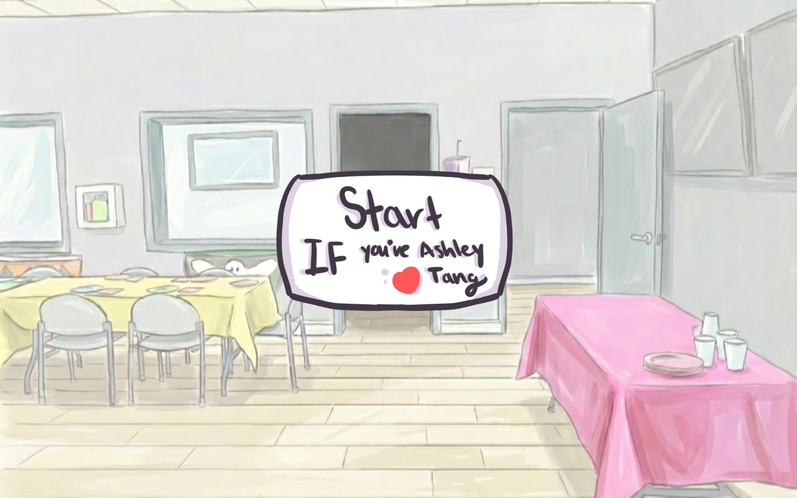
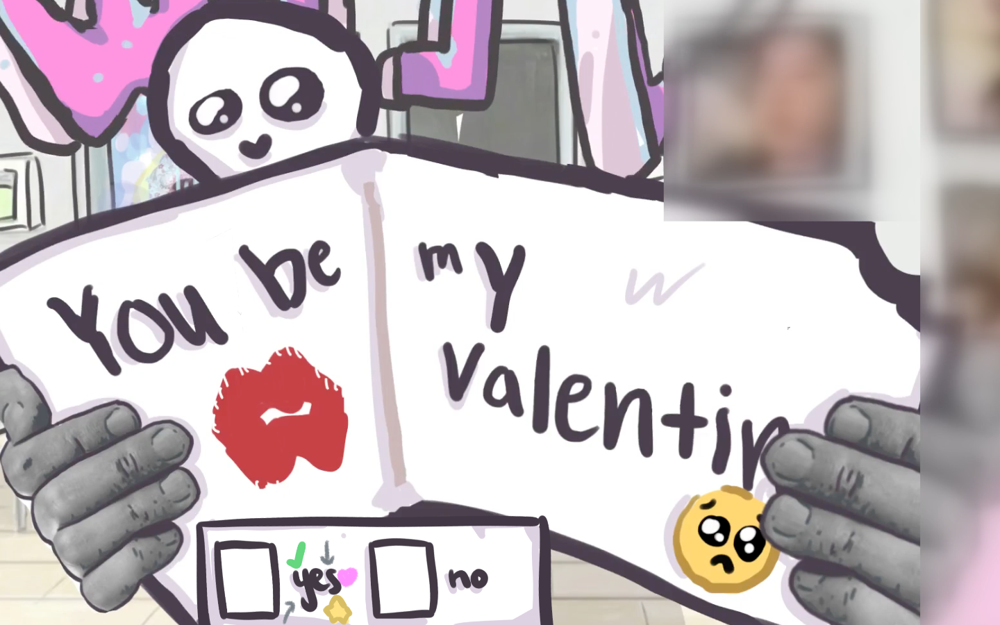
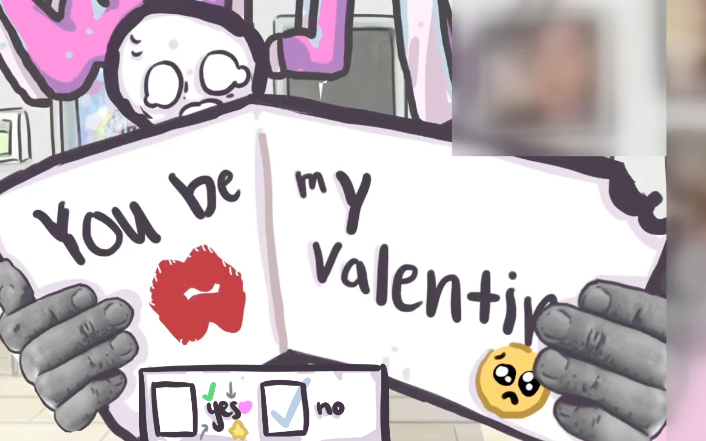
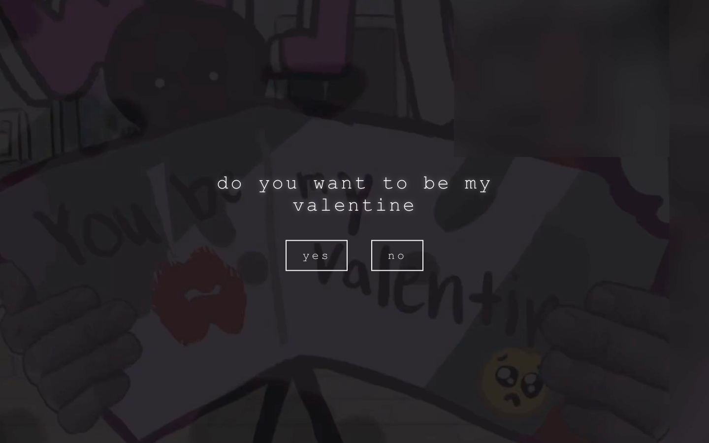

# be my valentine

An interactive, hand-drawn animated short that asks one question — *will you be my valentine?* — and refuses to take no for an answer.

It plays like a tiny point-and-click film: a watercolor world, a note that slides up asking the question, a character that reacts to every hover and click, and a soundtrack that changes with the mood. Keep saying no and the room goes dark and asks you directly. Say no one too many times and, well, you find out.

Built as a Valentine's gift for one specific person, then rebuilt as a clean, self-contained front-end project.

<p align="center">
  
</p>

## How it plays

| The ask | The reaction |
| --- | --- |
|  |  |

After three refusals the lights cut out and the question gets asked outright, one keystroke at a time:

<p align="center">
  
</p>

## What's interesting under the hood

The whole thing is a single-page React app with no backend, but it leans on a few techniques to make a stack of video clips feel like one continuous, responsive scene:

- **Seamless clip transitions.** Two stacked `<video>` elements crossfade by swapping z-index: the next clip is loaded onto the hidden layer and only brought forward once it can play through, so there's never a flash of black between cuts. A generation counter cancels stale callbacks when the user clicks faster than clips can load.
- **Frame-accurate audio.** Several clips store their soundtrack as a separate file. The stage waits for both the video *and* its audio track to be ready, then starts them on the same tick so nothing drifts out of sync.
- **Everything preloaded.** On mount, every clip is fetched and decoded into a blob URL and every still frame is warmed in the browser cache, so transitions are instant rather than network-bound.
- **A cinematic dolly.** A `requestAnimationFrame` loop eases the stage's zoom toward a target each frame, giving phase changes a gentle push-in instead of a hard cut.
- **One small state machine.** The experience is a set of phases (prestart → start → opening → three trials → darkroom → finale, with an explosion ending hiding off to the side). Each phase owns one screen and the inputs that move it to the next.

## Tech stack

- [React 19](https://react.dev/) + [Vite](https://vite.dev/)
- [canvas-confetti](https://github.com/catdad/canvas-confetti) for the heart burst on "yes"
- Plain CSS, hand-drawn art, and original audio — no UI framework

## Project structure

```
src/
├── App.jsx              # the state machine: phases, transitions, input handlers
├── components/          # one component per screen
│   ├── Stage.jsx        #   the two crossfading background videos
│   ├── PrestartScreen.jsx
│   ├── StartScreen.jsx
│   ├── PaperPrompt.jsx  #   the trials: the note + yes/no hitboxes
│   ├── Darkroom.jsx     #   the typed-out question
│   ├── Explosion.jsx    #   the hidden ending
│   └── Finale.jsx       #   the payoff
├── hooks/
│   ├── useVideoStage.js # dual-video crossfade engine + synced audio + preload
│   ├── useAudio.js      # music, sfx, and the finale soundtrack
│   ├── useZoomLerp.js   # the per-frame zoom easing
│   └── useTypewriter.js # the keystroke-by-keystroke text effect
├── config/
│   ├── assets.js        # every video / image / audio path, in one place
│   ├── phases.js        # the phase definitions
│   └── script.js        # all on-screen copy
├── lib/
│   ├── confetti.js      # the celebratory heart burst
│   └── preload.js       # image warming
└── styles/              # global reset + per-screen styles
```

The intent: components describe *what* each screen looks like, hooks own the *how* of playback and animation, and `config/` holds the data so the writing and asset list can change without touching logic.

## Running it locally

```bash
npm install
npm run dev      # start the dev server (http://localhost:5173)
npm run build    # production build into dist/
npm run preview  # serve the production build
npm run lint     # eslint
```

Then click "run", make sure your sound is on, and try saying no a few times.

## Make it yours

All of the on-screen copy lives in [src/config/script.js](src/config/script.js) as placeholders — the finale letter, the headline, and the hidden game-over line. Drop in your own message there and the rest of the experience stays exactly as is.

## Credits

Art, audio, and animation are original.
