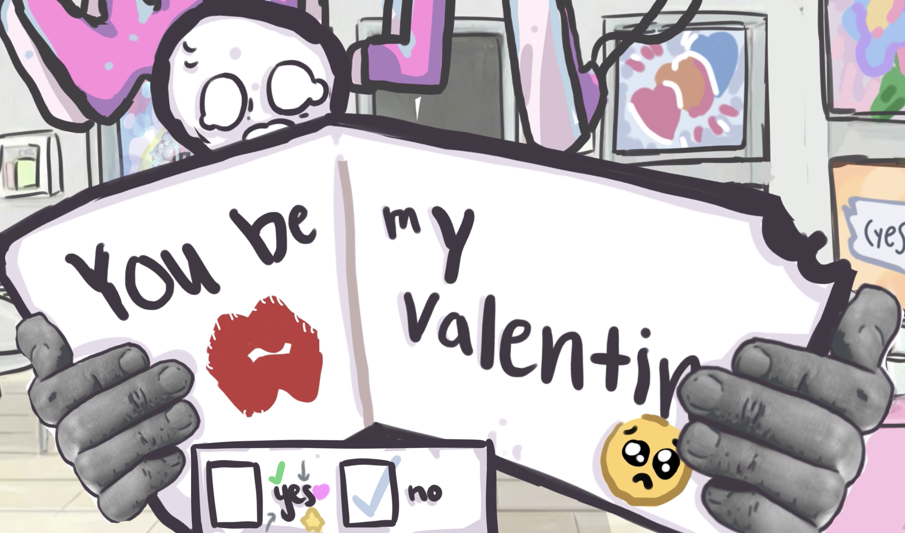
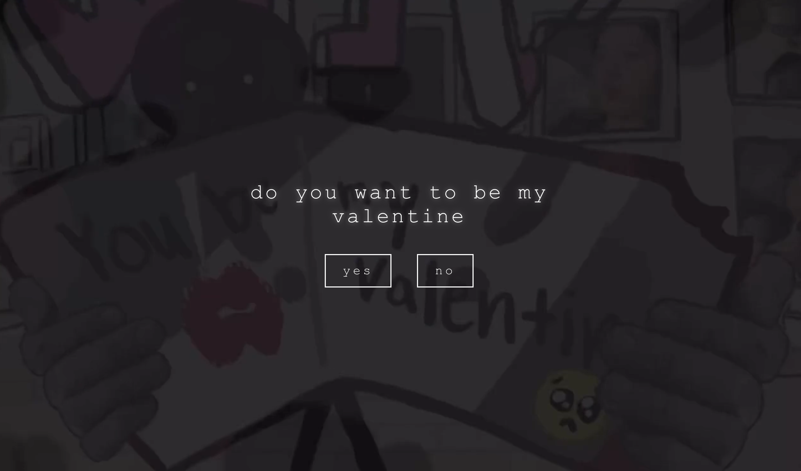
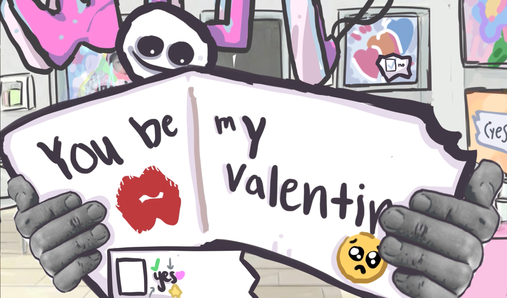

# be my valentine

A little hand-drawn, point-and-click thing that asks you to be its valentine and then absolutely refuses to take no for an answer.

It plays like a tiny film you click through: a watercolor room, a note that slides up and pops the question, a cat that reacts to every hover, and music that shifts with the mood. Say no and it gets nervous. Keep saying no and it stops being polite about it.

<p align="center">
  
</p>

## How it goes

It hands you a card. There are two checkboxes. You are, in theory, free to pick either one.

| The ask | The reaction |
| --- | --- |
|  |  |

Say no enough times and the lights cut out. The question gets typed at you one letter at a time, and you are politely informed that you have a choice. You do not, really.

<p align="center">
  
</p>

So eventually you cave. Everybody caves.

<p align="center">
  
</p>

## What's in here

**10 hand-animated scenes**, drawn, voiced, and scored from scratch — **40+ original assets** all told: 14 video clips, a dozen painted stills, and 16 audio tracks, each cut to its own moment so the room never feels the same way twice.

| | | | | |
| --- | --- | --- | --- | --- |
|  |  |  |  |  |

## A few notes on how it's built

A single-page React app — no backend, no UI framework, just the art, the audio, and a small amount of glue.

The part I'm quietly proud of: it stitches those separate clips into one continuous scene. Two video layers crossfade so cuts never flash black, each clip's audio starts on the exact frame its video does so nothing drifts, and everything preloads up front so clicking feels instant. There's a gentle camera push-in on the bigger beats. Under all of it, the whole experience is just a handful of phases, each owning a screen and the one input that moves you to the next.

## Stack

- React + Vite
- canvas-confetti for the heart burst (you'll get there)
- Plain CSS, original art, original audio

## Running it

```bash
npm install
npm run dev
```

Sound on, and try saying no a few times.

## Credits

All art, audio, and animation are mine.
